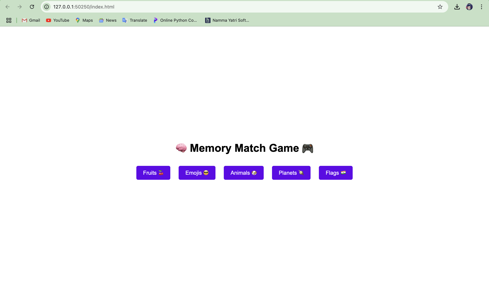
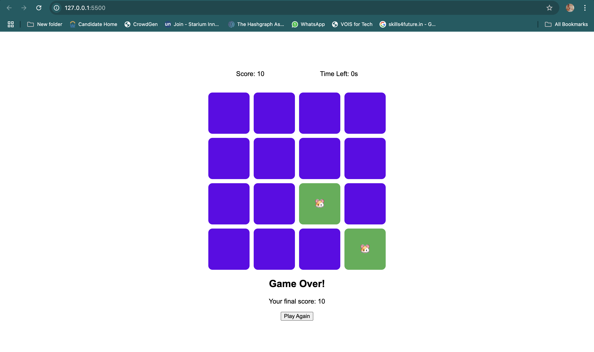

#   🧠 Memory Match Game 🎮

## 🎮 About the Game
A fun and interactive memory card game where players can choose from multiple categories (Fruits, Emojis, Animals, Planets, Flags) and match pairs before time runs out. 

## 🛠 Key Features
- **Multiple Categories:** Players can choose from different themes to play with.
- **Dynamic Grid Generation:** The game dynamically creates a shuffled grid based on the selected category.
- **Countdown Timer:** The game starts with 30 seconds, challenging players to match all pairs before time runs out.
- **Persistent Game State:** Score, time left, and matched pairs are saved using `localStorage`.

## 🎲 Game Mechanics
- **Card Handling:**
  - Cards are randomly shuffled at the start of the game.
  - Players click on cards to reveal them.
  - If two selected cards match, they remain visible; otherwise, they flip back after a short delay.
- **Timer System:**
  - A 30-second countdown is implemented using `setInterval`.
  - The game ends when the timer reaches zero or all pairs are matched.
- **State Management:**
  - Game progress (score, time left, matched pairs, and flipped cards) is stored in `localStorage` for persistence.

## 🔊 Extra Features
- **Sound Effects:**
  - Card flip, match confirmation, and game over events use the Audio API for enhanced experience.
- **Restart Functionality:**
  - A "Play Again" button allows players to restart the game and clear the saved state.

## 📜 How to Play
1. Select a category to generate a set of cards.
2. Click on two cards to reveal them.
3. Match pairs before the time runs out!
4. Complete the game to achieve the highest score!

## 🛠 Technologies Used
- **HTML, CSS, JavaScript**
- **LocalStorage API** (to save game state)
- **Audio API** (for sound effects)

## 🤝 Contributing
Feel free to contribute! Open an issue or submit a pull request.

## Screen Shots

## Video
[You can Download Output Video from here](Project-2/otput_video.mov)
